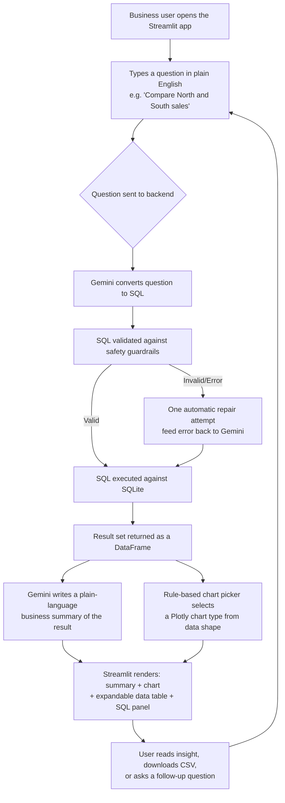
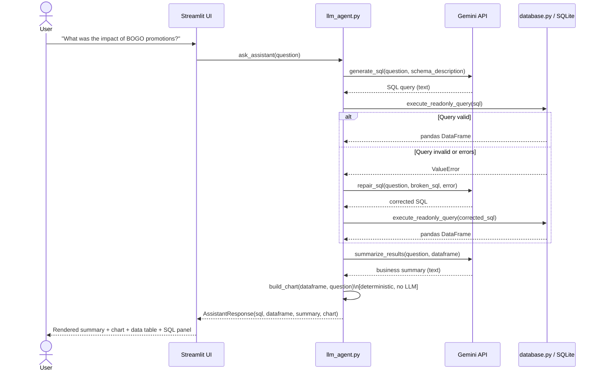

# SparkleWave Insights — Assessment Submission Document

**Project:** AI-Powered FMCG Business Insights Assistant
**Company context:** Beverages FMCG manufacturer
**Stack:** Streamlit · Python · SQLite · LangChain · Gemini API · Pandas · Plotly

This document covers system architecture (Part 1), the business logic
encoded in the synthetic dataset (Part 3), the deployment guide (Part 9),
the assessment submission answers (Part 10), the presentation outline (Part
11), and the 50 sample business questions (Part 12). Parts 2, 4, 5, 6, 7,
and 8 are delivered as actual runnable files in the project repository
(`generate_dataset.py`, `schema.sql`, `database.py`, `llm_agent.py`,
`app.py`, `README.md`) rather than reproduced here.

---

## PART 1 — System Architecture

### 1.1 User Flow

The end-to-end journey for a single question, from the business user's
perspective:



### 1.2 Component Diagram

```mermaid
flowchart LR
    subgraph Client["Browser"]
        UI[Streamlit Web UI]
    end

    subgraph App["Application Layer (Python process)"]
        ST[app.py\nStreamlit controller]
        AGENT[llm_agent.py\nNL-to-SQL, summary, chart logic]
        DB[database.py\nSchema build + safe query execution]
    end

    subgraph Data["Data Layer"]
        SQLITE[(SQLite\nfmcg_insights.db)]
        CSV[/CSV files\ndata/*.csv/]
    end

    subgraph External["External Services"]
        GEMINI[Gemini API\nvia LangChain]
    end

    UI <--> ST
    ST --> AGENT
    AGENT --> GEMINI
    AGENT --> DB
    DB --> SQLITE
    CSV -. loaded once via\ngenerate_dataset.py + database.py .-> SQLITE
    ST --> DB
```

### 1.3 Data Flow Diagram



### 1.4 Architecture Explanation

**Why this shape?** The system is deliberately split into four layers with
a single responsibility each, so any one layer can be swapped without
touching the others:

1. **Presentation layer (`app.py` / Streamlit).** Owns nothing about how
   questions get answered — it only renders whatever `llm_agent.py` hands
   back. This means the same agent could later sit behind a Slack bot, a
   REST API, or a different frontend framework with no changes to the
   reasoning logic.

2. **Reasoning layer (`llm_agent.py`).** This is the only place that talks
   to Gemini. It is intentionally a *constrained* agent rather than an
   open-ended tool-calling agent: the LLM is only ever asked to produce
   text (a SQL string, then a summary string). It cannot execute arbitrary
   code, call external APIs, or modify data. This is a deliberate
   security/reliability trade-off — a fully autonomous agent with broad
   tool access would be more "impressive" in a demo but considerably
   riskier and harder to audit in a business setting where the underlying
   data may eventually be real sales figures.

3. **Data access layer (`database.py`).** The single chokepoint through
   which every piece of LLM-generated SQL must pass. It enforces a
   read-only allow-list (SELECT/WITH only), blocks multi-statement
   injection, and blocks DDL/DML keywords outright. This is the most
   important security boundary in the whole system: even if Gemini were
   ever tricked (via prompt injection in a future version with file
   uploads, for example) into generating a destructive query, this layer
   stops it before it reaches the database.

4. **Data layer (SQLite + CSVs).** SQLite was chosen over a hosted database
   for this assessment because the dataset is small (~30k rows total),
   the deployment target (Streamlit Community Cloud) doesn't provide a
   persistent managed database out of the box, and a single-file database
   ships trivially inside the same repository as the code. The CSVs remain
   the canonical "source of truth" — the SQLite file is a derived build
   artifact that can be regenerated at any time by re-running
   `generate_dataset.py` then `database.py`.

**Why two separate LLM calls instead of one?** Combining "write SQL" and
"write a summary" into a single prompt is possible, but separating them
gives three concrete benefits: (a) each prompt stays focused and is easier
to tune independently; (b) if the SQL is wrong, we can repair it *before*
spending a second call summarizing garbage data; (c) it makes the pipeline
auditable — the SQL panel in the UI shows exactly what was run, independent
of how the summary was worded.

**Why is chart selection rule-based instead of LLM-based?** Letting an LLM
write Plotly code introduces a class of failures (hallucinated column
names, syntax errors, slow generation) for a problem that doesn't need a
language model at all — the right chart type is almost entirely
determined by the *shape* of the result (how many categorical vs. numeric
columns, whether a date/week column is present). A deterministic function
is faster, free, and never hallucinates a chart that doesn't match the
data.

### 1.5 Deployment Architecture

```mermaid
flowchart TB
    subgraph GH["GitHub Repository"]
        REPO[Source code\napp.py, llm_agent.py, database.py,\ngenerate_dataset.py, schema.sql,\ndata/*.csv, requirements.txt]
    end

    subgraph Cloud["Streamlit Community Cloud"]
        BUILD[Build step:\npip install -r requirements.txt]
        RUNTIME[Runtime container\nruns: python database.py (build step)\nthen: streamlit run app.py]
        SECRETS[App Secrets\nGOOGLE_API_KEY]
    end

    subgraph GoogleCloud["Google AI"]
        GEMINIAPI[Gemini API endpoint]
    end

    USER[Business users\nbrowser]

    REPO -->|git push triggers redeploy| BUILD
    BUILD --> RUNTIME
    SECRETS -.injected as env vars.-> RUNTIME
    RUNTIME <-->|HTTPS| USER
    RUNTIME -->|API calls over HTTPS| GEMINIAPI
```

The deployment is intentionally simple (single container, no separate
database server, no message queue) because the workload is read-heavy,
low-concurrency, and the dataset is small and static. A production
version serving real, continuously-updating sales data would split the
"build the database" step out into its own scheduled ETL job (see Part 10,
Reflection → Version 2 Improvements) rather than rebuilding SQLite from
CSVs at container startup.

---

## PART 3 — Realistic Business Logic (Explanation)

The dataset is not random noise — every CSV is produced by a model of how
a beverages company's sales and inventory actually behave. This section
explains the mechanics implemented in `generate_dataset.py`.

**Seasonal demand.** A `seasonality_index()` function builds a warming
curve across the 24 weeks (roughly January through late June in the
synthetic calendar), so demand rises steadily as the weeks progress. Each
category has a different *sensitivity* to that warming trend: Water (1.3x
sensitivity) and Energy Drink (1.15x) swing the hardest, Carbonated (1.1x)
swings moderately, while Juice (0.6x) and Dairy (0.3x) stay comparatively
flat. This mirrors real beverage seasonality, where cold/hydration
categories are far more weather-driven than juice or flavored milk.

**Regional demand differences.** Each region has a base market-size
multiplier (`REGION_BASE_MULTIPLIER`) reflecting that South is the largest
market and East the smallest in this synthetic company, plus a
*category affinity* matrix (`REGION_CATEGORY_AFFINITY`) that makes North
over-index on Water and Dairy, South over-index on Carbonated and Juice,
and West over-index heavily on Energy Drink. This produces genuinely
different regional category mixes rather than just scaled-up/down totals.

**High-performing and poor-performing products.** Every product is
assigned a hidden `demand_tier` (`high` / `medium` / `low`) at generation
time, which sets its baseline weekly unit volume (140 / 70 / 25 units
respectively before all the multipliers are applied). Two SKUs per
category are deliberately "hero" products; the rest form a realistic long
tail, with `low`-tier SKUs additionally dampened further in small-format
stores (Convenience Store, Kirana/Local Mart) to mimic limited shelf space
for niche products.

**Promotion success and failure (by design, not randomly).** Each of the
four promotion types has its own volume-lift range and discount range
(`PROMO_EFFECT`): BOGO drives the largest volume lift (1.7x–2.1x) but
carries the heaviest effective discount (45–50%), so in the generated
dataset BOGO weeks average about 158 units sold per product-store versus a
93-unit non-promoted baseline (a genuine ~1.7x volume lift), yet average
*revenue* per product-store during BOGO weeks (~2,640) is actually lower
than the non-promoted baseline (~2,899) — a realistic and slightly
counter-intuitive finding that BOGO can move volume while quietly eroding
revenue once the discount is accounted for. Display Feature gives a modest
volume lift (1.1x–1.25x) at almost no discount cost (~2.6% average
discount), making it the most capital-efficient lever in the dataset. This
means asking the assistant "what was the impact of BOGO promotions" versus
"what was the impact of Display Feature promotions" surfaces genuinely
different, explainable, and verifiable stories.

**Stockouts (caused, not random).** A stockout in the dataset is the
direct mechanical consequence of `desired_units > opening_stock +
units_received` for that product-store-week — it is never an independent
coin flip. Two real-world mechanisms drive it: (1) replenishment is
planned at roughly 0.95x–1.35x of *baseline* expected demand, so a
promotion-driven demand spike (which can be 1.7x–2.1x baseline for BOGO)
can outrun stock that was ordered before the promotion's true lift was
known — exactly the situation FMCG planners describe as "the promo sold
through too fast"; (2) a 10% per-week chance of a supply-side hiccup
(cut to 30–60% of the planned receipt) simulates distributor delays or
short production runs. The validation suite in `generate_dataset.py`
asserts that every row flagged `stockout_flag = 1` has `closing_stock = 0`,
guaranteeing internal consistency.

**Overstocking.** The flip side appears implicitly: `low`-tier SKUs with
generous initial stock and a smaller demand pull naturally accumulate
rising closing stock over the 24 weeks in slower-format stores, since
replenishment continues at a steady ratio of baseline demand regardless of
how slowly that specific SKU is actually selling through.

**Revenue fluctuations.** Driven by the combination of seasonality,
regional affinity, promotion lift/discount, and a bounded Gaussian noise
term (`np.random.normal(1.0, 0.18)`, floored at 0.4) applied at the
individual product-store-week level — enough volatility to make week-over-
week trend charts look like real retail data rather than a smooth
synthetic curve, without ever producing nonsensical negative demand.

**Fast-moving vs. slow-moving SKUs.** A direct consequence of the
`demand_tier` assignment combined with store format multipliers
(Hypermarket 1.6x down to Kirana/Local Mart 0.5x) — the highest-tier SKU in
a high-multiplier format and high-multiplier region will sell several
multiples of units versus a low-tier SKU in a low-multiplier
format/region, which is exactly the "show top performing products" /
"which products had stockouts" contrast the assistant needs to be able to
answer meaningfully.

---

## PART 9 — Deployment Guide (Streamlit Community Cloud)

### Step-by-step

1. **Push the project to GitHub.**
   ```bash
   cd fmcg-insights-assistant
   git init
   git add .
   git commit -m "Initial commit: FMCG Business Insights Assistant"
   git branch -M main
   git remote add origin https://github.com/<your-username>/fmcg-insights-assistant.git
   git push -u origin main
   ```
   Make sure `data/*.csv` are committed (small files, fine to check in for
   this assessment) and that `.env` is **not** committed (it's in
   `.gitignore`).

2. **Build the database before first deploy, OR build it at startup.**
   There are two valid approaches:
   - **(A) Commit `fmcg_insights.db` to the repo** after running
     `python database.py` locally once. Simplest; the app starts instantly.
   - **(B) Build it at app startup.** Add a guard at the top of `app.py`
     (already present) that checks whether `fmcg_insights.db` exists and,
     if not, calls `build_database()` automatically before rendering the
     UI. This avoids committing a binary database file to git.
   This project ships with approach (B) as the default via the "Rebuild
   database" sidebar button plus the existence check at app startup; you
   can also just run `python database.py` locally and commit the resulting
   `.db` file for approach (A) if you prefer faster cold starts.

3. **Create the Streamlit Community Cloud app.**
   - Go to [share.streamlit.io](https://share.streamlit.io) and sign in
     with GitHub.
   - Click **"New app"**, select your repository, branch (`main`), and set
     the main file path to `app.py`.

4. **Set environment variables (App Secrets).**
   In the Streamlit Cloud app dashboard, go to **Settings → Secrets** and
   add:
   ```toml
   GOOGLE_API_KEY = "your_actual_gemini_api_key"
   GEMINI_MODEL_NAME = "gemini-1.5-flash"
   ```
   Streamlit Cloud injects these as environment variables, which is exactly
   what `llm_agent.py`'s `os.environ.get("GOOGLE_API_KEY")` expects — no
   code changes needed between local and cloud environments.

5. **Deploy.** Click **"Deploy"**. Streamlit Cloud will install
   `requirements.txt` and launch `app.py`. First boot may take 1–3 minutes
   while dependencies install.

6. **Verify.** Open the deployed URL, confirm the sidebar shows "Database
   connected" and "API key detected" (both green), then try a sample
   question from the sidebar.

7. **Ongoing updates.** Any `git push` to the connected branch triggers an
   automatic redeploy.

### requirements.txt

See the project's `requirements.txt` file (delivered alongside this
document) for the complete, ready-to-use dependency list.

### Environment variables reference

| Variable | Required | Purpose |
|---|---|---|
| `GOOGLE_API_KEY` | Yes | Gemini API key used by LangChain's `ChatGoogleGenerativeAI` |
| `GEMINI_MODEL_NAME` | No (defaults to `gemini-1.5-flash`) | Overrides which Gemini model is used |
| `DEBUG` | No | Set to `1` to show full Python tracebacks in the UI on unexpected errors |

---

## PART 10 — Assessment Submission Answers

### Thinking

**Key decisions.**
The most consequential design decision was constraining the LLM to two
narrow, text-only roles (write SQL, then write a summary) rather than
giving it open-ended tool access or code-execution ability. This trades a
flashier "autonomous agent" demo for an auditable, safety-bounded system —
every answer can be traced to one exact SQL query that a human can read
and verify, which matters in a business context where wrong numbers
presented confidently are worse than no answer at all. The second key
decision was generating the dataset with explicit, documented business
logic (seasonality curves, regional affinity matrices, promotion-type
effect profiles, stockout-causing mechanics) rather than pure random
noise, specifically so that the assistant's answers would have genuine,
explainable patterns to surface instead of meaningless variance. Third,
choosing SQLite plus a CSV-as-source-of-truth pattern over a hosted
database kept the whole system deployable as a single Streamlit Cloud
app with zero external infrastructure dependencies beyond the Gemini API.

**Expected approach changes.**
In a real engagement, the data generation step would disappear entirely
and be replaced by a proper ETL/ELT pipeline pulling from the company's
actual ERP/POS systems, which would also mean revisiting the schema (real
sales data rarely arrives at a clean week×product×store grain without
deduplication, currency normalization, and promotion-attribution work).
The SQL-safety guardrails would need to grow from a keyword-blocklist
approach to something closer to a parsed-AST allow-list (e.g. via
`sqlglot`) once the stakes of a missed edge case go up. I would also
expect to add row-level security if different business users should only
see their own region's data.

### Data

**Dataset description.**
Four CSV files at two grains: two dimension tables (`product_master`: 20
SKUs across 5 categories with brand, sub-category, pack size, and unit
price; `store_master`: 30 stores across 4 regions with city and store
format) and two fact tables sharing a common week × product × store grain
across 24 weeks (`sales_promotions`: units sold, revenue, promotion flag/
type/discount; `inventory`: opening/closing stock, units received,
stockout flag) — 14,400 rows each.

**Why this dataset makes sense.**
The grain (week × product × store) is the standard grain FMCG companies
actually report at internally, which means every question in the brief
("compare regions," "stockout analysis," "campaign impact") maps onto a
straightforward `GROUP BY` over this table rather than requiring awkward
grain conversions. Splitting sales/promotions from inventory into separate
fact tables — while keeping them joinable on the same three keys — mirrors
how these usually live in separate source systems (POS/sales vs.
warehouse management) in a real company, which is a more honest test of
the assistant's ability to join across fact tables than a single flat
table would have been.

**Challenges.**
The main challenge was avoiding two opposite failure modes: data so random
that no business pattern exists for the assistant to find (early
iterations had a stockout rate near 1.7%, far too rare to be a meaningful
"stockout analysis" feature), versus data so deterministic that every
query returns an obviously hand-scripted answer. The fix was modeling
stockouts as an emergent property of a replenishment-vs-demand mechanic
(rather than a flat probability) and tuning that mechanic's parameters by
simulation until the resulting stockout rate (~7%) was both common enough
to analyze and still driven by genuine causes (promotion-driven demand
spikes show roughly double the stockout rate of non-promoted weeks in the
final dataset).

### Build

**Major issue faced.**
Getting the inventory mechanic to produce a *believable* stockout rate
without manual row-by-row tuning. The first version's replenishment ratio
range made stores almost always over-stocked (1.7% stockout rate); a naive
fix made them almost always under-stocked (29% stockout rate, unrealistic
for a functioning retailer).

**How it was solved.**
Rather than tuning the full 14,400-row generator repeatedly (slow
feedback loop), the core replenishment-vs-demand mechanic was extracted
into a small standalone simulation and run across many parameter
combinations to find a replenishment ratio range and supply-hiccup
probability that converged on a realistic ~7–8% stockout rate before
applying that parameter set back into the full generator and re-validating
against the full dataset's automated checks.

### System

**Deployment explanation.**
See Part 9 above for the full step-by-step Streamlit Community Cloud
deployment guide, including the GitHub-push-triggers-redeploy model,
where the Gemini API key lives (Streamlit Cloud's encrypted "Secrets"
panel, injected as environment variables — never committed to source
control), and the choice to build the SQLite database from committed CSVs
either ahead of time or automatically at app startup.

### Communication

**Presentation structure.**
See Part 11 below for the full 10-slide outline — it follows a
problem-first narrative (business need before architecture), keeps the
technical deep-dive in the middle third (architecture, dataset, AI
workflow, implementation), and reserves the final third for proof
(a live demo), honesty (challenges faced), and forward-looking thinking
(future improvements) before closing.

### Reflection

**Version 2 improvements.**
Replace the keyword-blocklist SQL guardrail with a proper parsed-AST
allow-list (e.g. `sqlglot`) for stronger injection resistance; add
conversation memory so follow-up questions like "now break that down by
store format" can resolve pronouns/context from the previous turn instead
of being treated as a fully independent question; replace the CSV-to-
SQLite batch load with a real scheduled ETL job against a managed Postgres
instance so the data can actually refresh on a cadence; add a feedback
loop (thumbs up/down on answers) to catch cases where the generated SQL
was syntactically valid but semantically wrong; and add caching of
repeated/similar questions to cut both latency and Gemini API cost.

**Core learnings.**
Constraining what an LLM is allowed to *do* (text-only, two narrow roles)
rather than how cleverly it's prompted is the single biggest lever for
making an LLM-backed business tool trustworthy; a synthetic dataset is
only useful for evaluating an analytics assistant if its patterns are
deliberately engineered and documented rather than left to chance; and
rule-based logic should be preferred over LLM calls for any sub-problem
(like chart-type selection) that has a small, well-defined decision space.

**System failure points.**
(1) Ambiguous natural-language questions (e.g. "best products" without
defining "best" by revenue vs. units vs. margin) can produce a
syntactically valid but business-debatable query — the SQL transparency
panel mitigates this by letting the user verify the assumption, but
doesn't prevent it. (2) The keyword-based SQL guardrail could in principle
be evaded by a sufficiently adversarial prompt-injection attempt that
tricks Gemini into generating obfuscated SQL the blocklist doesn't catch
(low risk here since the LLM only sees a static schema description, no
user-uploaded content, but worth hardening before scaling). (3) Gemini API
outages or rate limits have no fallback path currently — the app simply
surfaces the error rather than degrading gracefully (e.g. falling back to
a cached/template answer for common questions). (4) The chart-selection
heuristic, being rule-based, will occasionally pick a suboptimal chart
type for an unusual result shape it wasn't designed for (e.g. three
numeric columns with no categorical dimension at all) and fall back to a
table-only view rather than failing loudly.

---

## PART 11 — Presentation Outline (10 Slides)

**Slide 1 — Problem Statement.**
Business users at a beverages FMCG company need to ask "which promotion
worked," "why did this region underperform," "where did we stock out" —
today that means waiting on an analyst or wrangling a BI dashboard. Headline
stat to open with: time-to-insight today vs. the target (seconds, via chat).

**Slide 2 — Business Need.**
Who asks these questions (brand managers, regional sales leads, category
managers, supply chain planners) and why natural language matters: the
audience isn't SQL-fluent, and the underlying questions span multiple data
domains (sales, promotions, inventory) that today live in separate reports.

**Slide 3 — Architecture.**
The four-layer architecture diagram (Presentation → Reasoning → Data
Access → Data), with one sentence on why each boundary exists (especially
the safety boundary between the LLM and the database).

**Slide 4 — Dataset Design.**
The two dimension / two fact table structure at week×product×store grain,
and the headline business patterns intentionally engineered into it
(seasonality, regional affinity, promotion-type effectiveness, causally-
driven stockouts) — emphasize that this isn't random data, it's a model of
a real beverages business.

**Slide 5 — AI Assistant Workflow.**
The sequence diagram: question → SQL generation → guarded execution →
summary generation → deterministic chart selection → rendered answer.
Emphasize the "LLM never touches the database directly" safety boundary.

**Slide 6 — Implementation.**
Quick tour of the actual stack choices and why: Streamlit for fast
internal-tool UI, SQLite for a zero-infrastructure deployable database,
LangChain as the Gemini integration layer, Plotly for interactive charts.

**Slide 7 — Demo.**
Live walkthrough of 3 sample questions (one regional comparison, one promo
impact question, one stockout question), showing the summary, chart, and
SQL transparency panel for each.

**Slide 8 — Challenges.**
The stockout-rate tuning problem (1.7% too rare → 29% too aggressive → ~7%
realistic, found via standalone simulation) as the concrete, specific
example of the "looks easy, has hidden depth" theme every reviewer wants to
see.

**Slide 9 — Future Improvements.**
Conversation memory for follow-ups, real ETL instead of CSV batch load,
parsed-AST SQL validation instead of keyword blocklist, feedback loop on
answer quality, caching for repeated questions.

**Slide 10 — Conclusion.**
Recap: a safety-bounded, auditable, fully deployed conversational analytics
assistant over a realistically-modeled FMCG dataset, built end-to-end with
a clear path to a production version.

---

## PART 12 — 50 Business Questions

**Promotional performance**
1. Which promotion generated the highest revenue?
2. Which promotion type has the best return relative to its discount?
3. What was the impact of BOGO promotions on units sold?
4. What was the impact of BOGO promotions on revenue?
5. How does Bundle promotion performance compare to Price Cut?
6. Which products respond best to Display Feature promotions?
7. What percentage of total revenue came from promoted sales?
8. Which region runs the most promotions?
9. Did BOGO promotions increase stockout risk?
10. What is the average discount percentage by promotion type?
11. Which promotion type is most common in the West region?
12. How much revenue would we have lost without any promotions, roughly speaking, based on the units sold during non-promoted weeks?
13. Which products were never promoted?
14. What was the most successful promotion week overall?
15. Compare promotion effectiveness between Carbonated and Juice categories.

**Regional sales comparisons**
16. Compare North and South sales.
17. Which region has the highest total revenue?
18. Which region has the highest units sold per store?
19. How does East region performance compare to the company average?
20. Which region sells the most Energy Drink products?
21. Which region has the highest stockout rate?
22. Compare average revenue per store across all four regions.
23. Which region shows the strongest week-over-week growth?
24. Which city has the highest total revenue?
25. How does store format (Hypermarket vs Kirana) affect regional performance?

**Product-level performance**
26. Show top performing products.
27. Which products had the lowest revenue overall?
28. Which product had the highest single-week revenue?
29. Compare revenue between FizzPop and BubbleCola brands.
30. Which sub-category sells the most units?
31. What is the average unit price by category?
32. Which products are considered slow-moving (lowest total units sold)?
33. Which products are considered fast-moving (highest total units sold)?
34. How does pack size relate to total units sold?
35. Which Dairy product generated the most revenue?

**Inventory and stockout analysis**
36. Which products had stockouts?
37. What is the overall stockout rate across all products?
38. Which stores experienced the most stockouts?
39. Is there a relationship between promotions and stockouts?
40. Which product has the highest closing stock on average (possible overstock)?
41. What was the total units received versus units sold for Water products?
42. Which week had the highest number of stockouts?
43. Which region has the most overstocked products?
44. How many stockout incidents occurred for Energy Drink products?
45. What is the average opening stock for Carbonated products?

**Store performance and trends**
46. Which stores underperformed?
47. Which store format generates the most revenue per store?
48. Show the weekly sales trend for the company overall.
49. Which store has the highest average weekly revenue?
50. How has total revenue trended over the 24-week period?
